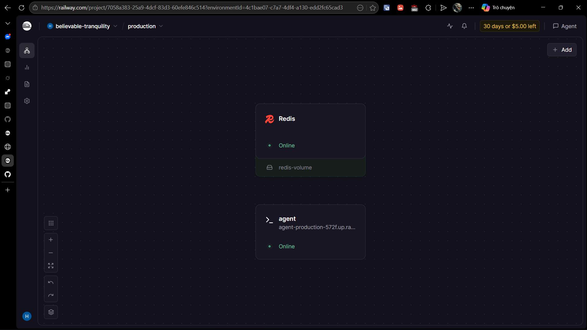
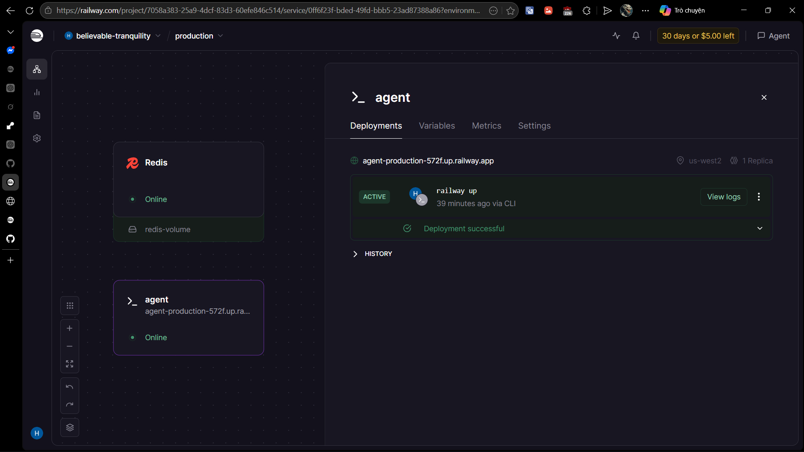

# Deployment Information

## Public URL

https://agent-production-572f.up.railway.app/

## Platform

Railway

## Test Commands

### Health Check

```bash
curl https://agent-production-572f.up.railway.app/health
# Expected: {"status": "ok", "redis": false}
```

### API Test (with authentication)

```bash

curl -X POST https://agent-production-572f.up.railway.app/ask \
  -H "X-API-Key: my-secret-key" \
  -H "Content-Type: application/json" \
  -d '{"question": "Hello from external client"}'
```

## Screenshots

### Deployment dashboard



### Service running



### Test results

