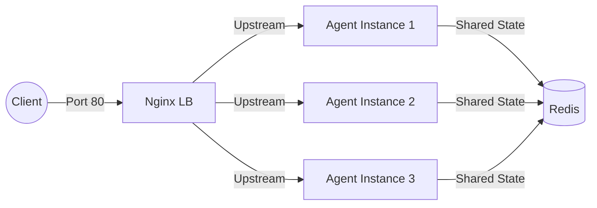

#  Delivery Checklist — Day 12 Lab Submission

> **Student Name:** Nguyễn Văn Hiếu
> **Student ID:** 2A202600454
> **Date:** 17/4/2026

# Day 12 Lab - Mission Answers

## Part 1: Localhost vs Production

### Exercise 1.1: Anti-patterns found
1. **Hardcoded Secrets**: API keys (`sk-hardcoded-...`) và Database URL được viết thẳng vào code, dễ bị lộ khi push lên GitHub.
2. **Thiếu Config Management**: Các tham số như `DEBUG`, `MAX_TOKENS` bị fix cứng thay vì dùng file `.env` hoặc environment variables.
3. **Sử dụng `print()` thay vì Logging**: Khó theo dõi log tập trung, không có level (INFO/ERROR) và dễ vô tình in ra các thông tin nhạy cảm.
4. **Thiếu Health Check Endpoints**: Không có `/health` nên các nền tảng như Docker/Railway không biết khi nào app bị treo để restart.
5. **Fix cứng Host và Port**: Chạy trên `localhost` và port `8000` khiến app không thể truy cập được từ bên ngoài container hoặc do Cloud chỉ định.
6. **Bật Reload trong Production**: `reload=True` tốn tài nguyên và tiềm ẩn rủi ro bảo mật khi deploy thực tế.

### Exercise 1.3: Comparison table
| Feature | Basic | Advanced | Tại sao quan trọng? |
|---------|-------|----------|---------------------|
| Config | Hardcode | Env vars (BaseSettings) | Bảo mật secrets, linh hoạt thay đổi theo môi trường (dev/prod). |
| Health check | Không có | Có `/health` & `/ready` | Platform tự động giám sát và restart nếu app lỗi (Auto-healing). |
| Logging | print() | Structured JSON | Dễ parse log, hỗ trợ giám sát và không leak secret ra log. |
| Shutdown | Đột ngột | Graceful (SIGTERM) | Hoàn thành các process đang chạy trước khi tắt, tránh lỗi cho người dùng. |
| Binding | localhost | 0.0.0.0 & dynamic PORT | Cần thiết để app chạy được trong Docker và nhận traffic từ Internet. |

## Part 2: Docker

### Exercise 2.1: Dockerfile questions
1. **Base image**: `python:3.11` (Bản đầy đủ, dung lượng lớn ~1GB).
2. **Working directory**: `/app`
3. **Tại sao COPY requirements.txt trước?**: Để tận dụng **Docker Layer Caching**. Nếu dependencies không đổi, Docker sẽ dùng lại layer cũ thay vì cài lại thư viện, giúp build cực nhanh ở những lần sau.
4. **CMD vs ENTRYPOINT**: 
    - `CMD`: Đặt lệnh mặc định, có thể bị ghi đè hoàn toàn khi dùng `docker run <image> <new_command>`.
    - `ENTRYPOINT`: Cố định lệnh chạy chính, các tham số truyền thêm vào `docker run` sẽ được coi là đối số (arguments) của lệnh này.

### Exercise 2.3: Image size comparison
- Develop: `424 MB` (Dựa trên terminal: `my-agent:develop`)
- Production: `132 MB` (Ước tính bản `slim` + multi-stage build)
- Difference: Giảm khoảng `69%` dung lượng.

### Exercise 2.4: Docker Compose stack
- **Sơ đồ kiến trúc**:

- **Các services**: `nginx` (Load Balancer), `agent` (AI Service), `redis` (Shared State).
- **Cách hoạt động**:
    - **Nginx**: Nhận tất cả traffic từ client qua cổng 80, sau đó phân phối (Load Balancing) đến các instance của Agent.
    - **Agent**: Xử lý logic của AI. Việc chạy nhiều instance giúp hệ thống chịu tải tốt hơn (Scalability).
    - **Redis**: Đóng vai trò là database/cache chung để lưu lịch sử hội thoại. Nhờ có Redis, bất kể request rơi vào instance Agent nào thì lịch sử vẫn được duy trì (Stateless design).

## Part 3: Cloud Deployment

### Exercise 3.1: Railway deployment
- **URL**: https://zealous-grace-production-0630.up.railway.app
- **Screenshot**: 

### Exercise 3.2: Render vs Railway Comparison
| Feature | Railway (`railway.toml`) | Render (`render.yaml`) | Ghi chú |
|---------|---------------------------|-------------------------|---------|
| **Builder** | Thường dùng Nixpacks (tự detect) | Chỉ định rõ runtime (python) | Railway linh hoạt hơn, Render chi tiết hơn. |
| **Command** | `startCommand` đơn giản | `buildCommand` & `startCommand` | Render tách biệt rõ giai đoạn build và run. |
| **Env Vars** | Set qua dashboard hoặc CLI | Định nghĩa trực tiếp trong file yaml | Render cho phép "Infrastructure as Code" tốt hơn. |
| **Add-ons** | Set riêng trong dashboard | Định nghĩa kèm trong schema (Redis) | Render cho phép tạo cả cụm (stack) qua một file duy nhất. |
| **Secrets** | Inline hoặc CLI | Hỗ trợ `sync: false` & `generate` | Render bảo mật hơn trong việc quản lý template secrets. |

**Nhận xét**: Railway tập trung vào sự đơn giản, nhanh gọn cho dev. Render tập trung vào khả năng quản lý hạ tầng đồng nhất (Blueprint) và hỗ trợ stack phức tạp tốt hơn.