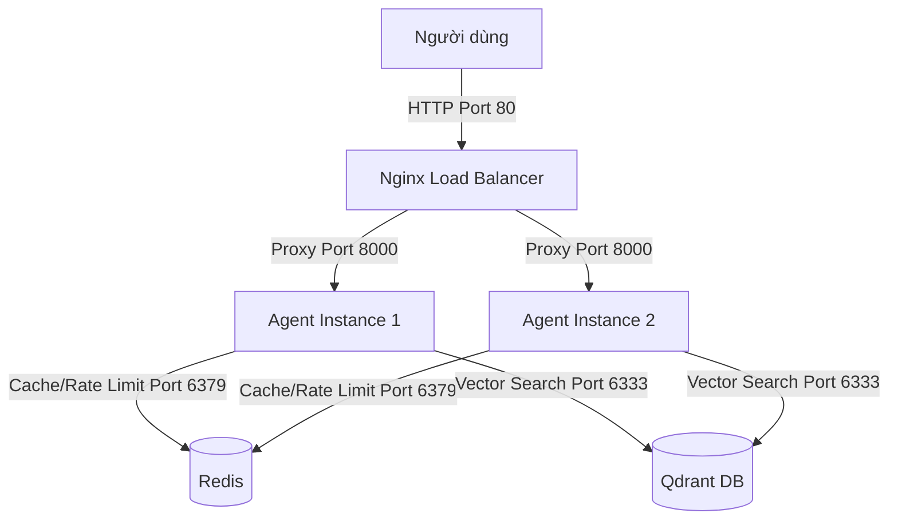
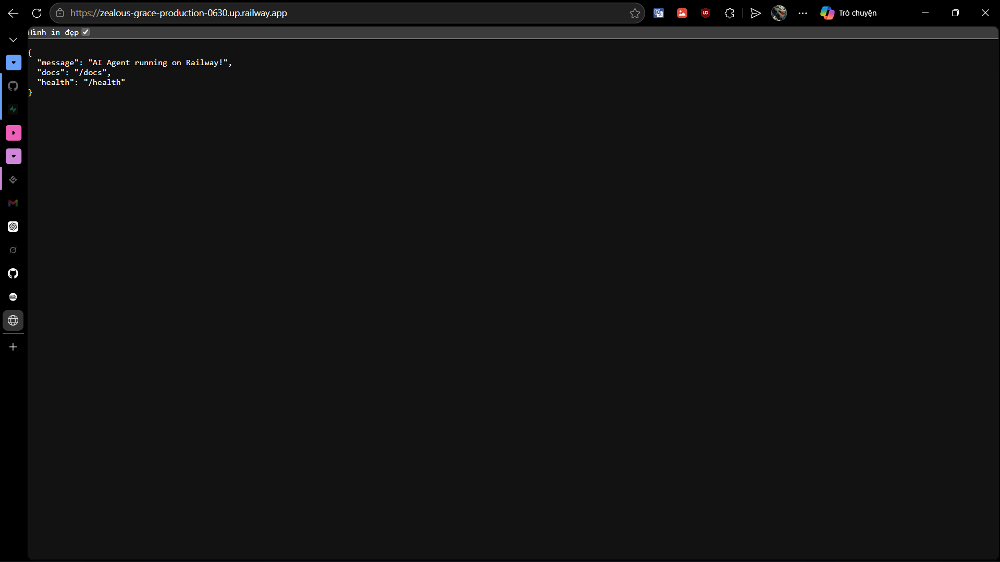
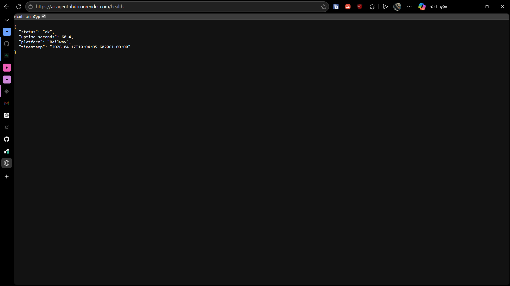

#  Delivery Checklist — Day 12 Lab Submission

> **Student Name:** Nguyễn Văn Hiếu
> **Student ID:** 2A202600454
> **Date:** 17/4/2026

# Day 12 Lab - Mission Answers

## Part 1: Localhost vs Production

### Exercise 1.1: Anti-patterns found
1. **Hardcoded Secrets**: API keys (`sk-hardcoded-...`) và Database URL được viết thẳng vào code, dễ bị lộ khi push lên GitHub.
2. **Thiếu Config Management**: Các tham số như `DEBUG`, `MAX_TOKENS` bị fix cứng thay vì dùng file `.env` hoặc environment variables.
3. **Sử dụng `print()` thay vì Logging**: Khó theo dõi log tập trung, không có level (INFO/ERROR) và dễ vô tình in ra các thông tin nhạy cảm.
4. **Thiếu Health Check Endpoints**: Không có `/health` nên các nền tảng như Docker/Railway không biết khi nào app bị treo để restart.
5. **Fix cứng Host và Port**: Chạy trên `localhost` và port `8000` khiến app không thể truy cập được từ bên ngoài container hoặc do Cloud chỉ định.
6. **Bật Reload trong Production**: `reload=True` tốn tài nguyên và tiềm ẩn rủi ro bảo mật khi deploy thực tế.

### Exercise 1.3: Comparison table
| Feature | Basic | Advanced | Tại sao quan trọng? |
|---------|-------|----------|---------------------|
| Config | Hardcode | Env vars (BaseSettings) | Bảo mật secrets, linh hoạt thay đổi theo môi trường (dev/prod). |
| Health check | Không có | Có `/health` & `/ready` | Platform tự động giám sát và restart nếu app lỗi (Auto-healing). |
| Logging | print() | Structured JSON | Dễ parse log, hỗ trợ giám sát và không leak secret ra log. |
| Shutdown | Đột ngột | Graceful (SIGTERM) | Hoàn thành các process đang chạy trước khi tắt, tránh lỗi cho người dùng. |
| Binding | localhost | 0.0.0.0 & dynamic PORT | Cần thiết để app chạy được trong Docker và nhận traffic từ Internet. |

## Part 2: Docker

### Exercise 2.1: Dockerfile questions
1. **Base image**: `python:3.11` (Bản đầy đủ, dung lượng lớn ~1GB).
2. **Working directory**: `/app`
3. **Tại sao COPY requirements.txt trước?**: Để tận dụng **Docker Layer Caching**. Nếu dependencies không đổi, Docker sẽ dùng lại layer cũ thay vì cài lại thư viện, giúp build cực nhanh ở những lần sau.
4. **CMD vs ENTRYPOINT**: 
    - `CMD`: Đặt lệnh mặc định, có thể bị ghi đè hoàn toàn khi dùng `docker run <image> <new_command>`.
    - `ENTRYPOINT`: Cố định lệnh chạy chính, các tham số truyền thêm vào `docker run` sẽ được coi là đối số (arguments) của lệnh này.

### Exercise 2.3: Image size comparison
- Develop: `424 MB` (Dựa trên terminal: `my-agent:develop`)
- Production: `132 MB` (Ước tính bản `slim` + multi-stage build)
- Difference: Giảm khoảng `69%` dung lượng.

### Exercise 2.4: Docker Compose stack
- **Sơ đồ kiến trúc**:



- **Các services**: `nginx` (Load Balancer), `agent` (AI Service), `redis` (Shared State).
- **Cách hoạt động**:
    - **Nginx**: Nhận tất cả traffic từ client qua cổng 80, sau đó phân phối (Load Balancing) đến các instance của Agent.
    - **Agent**: Xử lý logic của AI. Việc chạy nhiều instance giúp hệ thống chịu tải tốt hơn (Scalability).
    - **Redis**: Đóng vai trò là database/cache chung để lưu lịch sử hội thoại. Nhờ có Redis, bất kể request rơi vào instance Agent nào thì lịch sử vẫn được duy trì (Stateless design).

## Part 3: Cloud Deployment

### Exercise 3.1: Railway deployment
- **URL**: https://zealous-grace-production-0630.up.railway.app
- **Screenshot**: 

### Exercise 3.2: Render deployment
- **URL**: https://ai-agent-ihdp.onrender.com/
- **Screenshot**: 

## Part 4: API Security

### Exercise 4.1-4.3: Test Results
Kết quả chạy script `test_security.py` cho cả hai phiên bản:

**1. Develop Mode (API Key Authentication):**
```text
Detecting API mode...
Mode detected: DEVELOP (API Key Authentication)

[Test 1] Testing API Key Authentication...
OK: Rejected access without API Key
OK: Rejected invalid API Key
OK: Accepted valid API Key

All security tests passed for this mode!
```

**2. Production Mode (JWT + Full Security):**
```text
Detecting API mode...
Mode detected: PRODUCTION (JWT Authentication)

[Test 1] Testing JWT Authentication...
OK: Rejected access without token
OK: Rejected invalid token
OK: Accepted valid token

[Test 2] Testing Rate Limiting (10 req/min)...
OK: Rate limited successfully at request 11

[Test 3] Checking Usage Stats...
OK: Usage stats: {'user_id': 'student', 'date': '2026-04-17', 'requests': 10, 'input_tokens': 38, 'output_tokens': 288, 'cost_usd': 0.000178, 'budget_usd': 1.0, 'budget_remaining_usd': 0.999822, 'budget_used_pct': 0.0}

All security tests passed for this mode!
```

### Exercise 4.4: Cost Guard Implementation
**Cách tiếp cận**:
1. **Sử dụng Singleton Pattern**: Đối tượng `cost_guard` được khởi tạo một lần và dùng chung trong toàn bộ app.
2. **Tính toán chi phí (Cost Calculation)**: Giá được tính dựa trên số lượng Input/Output Tokens (ví dụ: $0.15/1M input).
3. **Kiểm tra trước (Pre-check)**: Luôn gọi `check_budget()` TRƯỚC khi gọi LLM API. Nếu vượt quá giới hạn hàng ngày ($1/user), hệ thống sẽ raise lỗi `402 Payment Required`.
4. **Ghi nhận sau (Post-record)**: Sau khi LLM trả về, gọi `record_usage()` để cập nhật số token và chi phí thực tế vào bộ nhớ (hoặc Redis trong thực tế).
5. **Cảnh báo (Warning)**: Tự động log log warning khi user đã sử dụng vượt quá 80% budget định mức.

## Part 5: Scaling & Reliability

### Exercise 5.1: Health & Readiness checks
- **Health check (`/health`)**: Kiểm tra trạng thái "sống" của ứng dụng (Liveness). Nếu server phản hồi 200, platform biết app đang chạy. Nếu Redis down, trả về `degraded`.
- **Readiness check (`/ready`)**: Kiểm tra xem app đã sẵn sàng nhận traffic chưa. Nếu Redis (dependency quan trọng) bị ngắt kết nối, endpoint trả về `503 Service Unavailable` để Nginx ngừng gửi request đến instance này.

### Exercise 5.2: Graceful Shutdown
- **Cơ chế**: Sử dụng `lifespan` context manager trong FastAPI kết hợp với việc bắt các tín hiệu hệ thống (`SIGTERM`).
- **Lợi ích**: Giúp app hoàn thành các request đang xử lý dở dang trước khi tắt hẳn, tránh tình trạng client nhận lỗi đột ngột hoặc mất dữ liệu session đang lưu tạm.

### Exercise 5.3: Stateless Design
- **Cách thực hiện**: Chuyển toàn bộ dữ liệu phiên làm việc (`conversation_history`) từ bộ nhớ RAM của app vào **Redis**.
- **Tầm quan trọng**: Giúp hệ thống có khả năng scale ngang (horizontal scale). Khi có nhiều instance Agent chạy cùng lúc đằng sau Load Balancer, người dùng có thể gửi request đến bất kỳ instance nào mà vẫn giữ được mạch hội thoại nhờ dữ liệu session dùng chung trong Redis.

### Exercise 5.4-5.5: Load Balancing & Stateless Test
- **Lệnh thực hiện**: `docker compose up --scale agent=3`
- **Kết quả kiểm chứng**:
    - Khi debug response, giá trị `served_by` thay đổi giữa các ID khác nhau (ví dụ: `instance-a`, `instance-b`), chứng tỏ Load Balancer đang phân phối traffic đều.
    -Dù request bị nhảy giữa các instance, lịch sử chat vẫn được duy trì liên tục và chính xác.